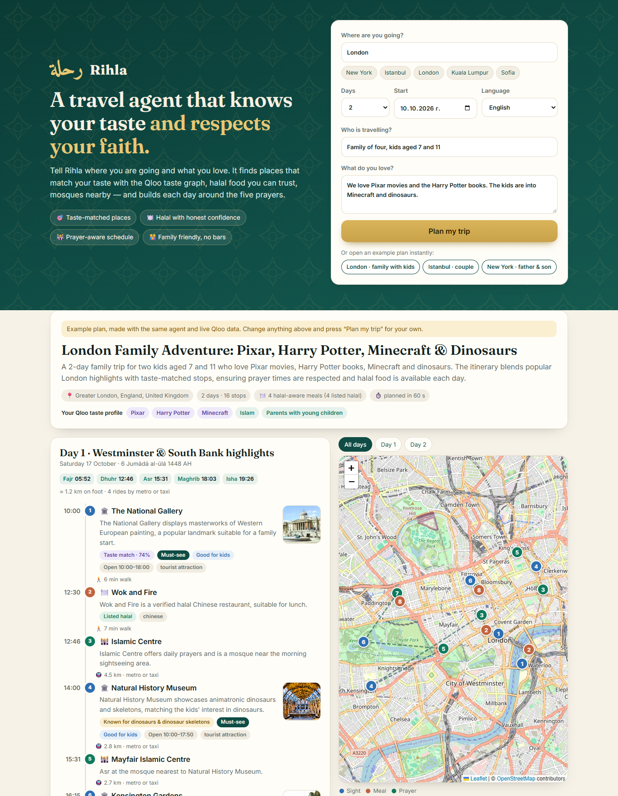
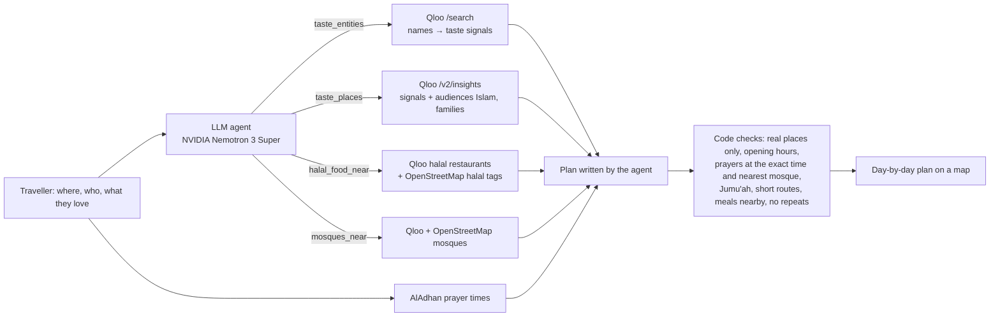

# Rihla — رحلة

**A travel agent that knows your taste and respects your faith.**

🌍 **Live demo:** https://rihla-agent.vercel.app · 🎬 **Video (1 min):** https://youtu.be/KpyL4OQyVLw · 📦 **Code:** https://github.com/me7ko-dev/rihla ·
[](https://github.com/me7ko-dev/rihla/actions/workflows/tests.yml)



Rihla plans city trips for Muslim travellers and families. Tell it where you are going, who is travelling and
what you love — films, books, authors, music, games, teams — and its agent builds a day-by-day plan:

- 🎯 **places that fit your taste**, with an honest reason: *"Because you love Orhan Pamuk"*, *"Known for dinosaurs"*
- 🍽️ **halal food with an honest confidence level** — *Listed halal*, *Likely halal* or *Ask* — and a clear
  *Serves alcohol* flag; bars, pubs and meyhanes are never suggested
- 🕌 **every day built around the prayers**: Dhuhr, Asr and Maghrib at the mosque nearest to where you are at that
  moment, with the day's real prayer times and Hijri date — and Jumu'ah at a well-known mosque on Fridays
- 🌙 **Ramadan-aware**: on fasting days there is nothing to eat between Fajr and Maghrib, iftar comes right after the
  Maghrib prayer, and Isha with Taraweeh is planned at a well-known mosque; Eid days are marked
- 👨‍👩‍👧 **family-aware**: *Good for kids* places, famous highlights mixed with personal finds

Built for the [Qloo Agentic Hackathon](https://qloo.devpost.com/).

## Why

Most AI travel planners are culturally blind: they send a Muslim family to a pub for dinner and forget that the
day has five prayers. Rihla is the opposite — it understands both what you love and how you live.

## How Qloo powers it

Qloo is behind every kind of stop, not just one feature:

| What | Qloo API |
|---|---|
| Your favourites become taste signals ("Harry Potter" → the book, not the album) | `/search`, ranked by name match, type and Qloo popularity |
| Sights ranked by your taste **and** by Qloo audiences *Islam* and *Parents with young children* | `/v2/insights` with `signal.interests.entities` + `signal.demographics.audiences` |
| Honest "because you love X": each taste is also asked on its own; a place carries the badge only if it is in that taste's own top results | `/v2/insights`, one query per signal |
| Famous highlights next to personal finds | `/v2/insights` without signals |
| Halal restaurants ranked by your taste; "listed" (halal-restaurant category) vs "mentioned" (reviews) | `filter.tags=urn:tag:cuisine:qloo:halal`, place tags |
| No bars, pubs, nightclubs, meyhanes — excluded on Qloo's side | `filter.exclude.tags` |
| Mosques, photos, descriptions, *good for kids*, what reviewers mention most ("dinosaurs" at the Natural History Museum) | place properties |

OpenStreetMap adds halal-tagged restaurants and more mosques; AlAdhan gives prayer times (calculation method per country).

## The agent



An LLM agent (NVIDIA Nemotron 3 Super, fallback Groq) researches with tools, then writes the itinerary:

1. `taste_entities` — turns everything you named into Qloo entities (only names you actually wrote; topics such as
   "dinosaurs" or "calligraphy" are matched against what places are known for)
2. `taste_places` — museums, landmarks, parks, family attractions… ranked by your taste
3. `halal_food_near`, `mosques_near` — for each day's area (Rihla fills any area the model forgot)
4. the plan — then code checks it: every stop must be a real place from the tools, meals must be eateries, prayer
   stops are moved to the exact prayer time and the nearest mosque, nothing repeats (not even another branch of a
   chain), and a place that matches what you said you love is never left out. The model cannot invent places.

## Run locally

```bash
pip install -r requirements.txt
cp .env.example .env   # add QLOO_API_KEY, NVIDIA_API_KEY (and optionally GROQ_API_KEY)
uvicorn app.main:app --port 8090
```

Open http://localhost:8090. Qloo responses are cached for a week (the hackathon key allows 10,000 requests a month).

Tests (offline, no keys needed: prayer times, Ramadan, halal levels, routing…): `pip install pytest && pytest -q`

## Reliability
- If the language model is unavailable, Rihla runs the same tools itself and assembles the plan from the same Qloo
  results, so a visitor never sees an empty error.
- If OpenStreetMap's geocoder refuses the server, the destination is found with Qloo instead.
- If AlAdhan cannot be reached, Rihla calculates the prayer times itself with the same method per country (within a
  minute or two of AlAdhan, rounded so a prayer is never shown before its time), the time zone from the coordinates
  and the Hijri date from the Umm al-Qura calendar.
- API keys stay on the server (never in the browser, never in error messages); a fair-use limit protects the
  monthly Qloo quota.

## License

MIT — see [LICENSE](LICENSE).

Data: taste data © Qloo · map data © OpenStreetMap contributors (ODbL) · prayer times: aladhan.com
